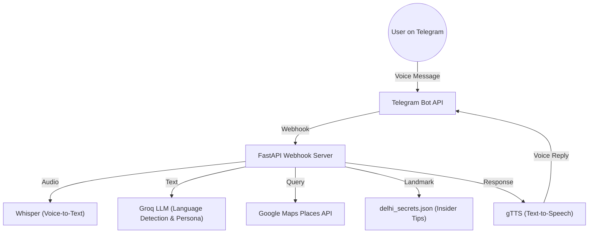

# 🕌 NomadAI: The Ultimate AI Travel Companion for Delhi


> **NomadAI** is not just a bot—it's your witty, multilingual, AI-powered best friend in Delhi! Experience the city like a true local, with real-time recommendations, secret tips, and voice-driven conversations in your language.

---

## 🚀 Features at a Glance

- **🎤 Voice-First Experience:** Send voice messages in any language—get instant, friendly voice replies.
- **🌏 Multilingual & Persona-Driven:** Adapts its personality and language (Hinglish, French, Spanish, English) to match yours.
- **📍 Real-Time Data:** Integrates Google Maps Places API for up-to-date recommendations.
- **🤫 Insider Secrets:** Shares curated, hyperlocal tips you won't find on Google.
- **🧠 Advanced AI:** Combines LLMs (Groq, Whisper) for language detection, synthesis, and creative responses.
- **⚡ Hackathon-Ready:** FastAPI backend, Telegram integration, and modular design for rapid deployment.

---

## 🏗️ Architecture Overview



---

## 🛠️ Quickstart

### 1. **Clone the Repo**
```bash
git clone <your-repo-url>
cd NomadAI
```

### 2. **Install Dependencies**
If you see permission errors, use `--user`:
```bash
pip install --user -r requirements.txt
```

### 3. **Configure Environment**
Create a `.env` file in the root:
```
TELEGRAM_BOT_TOKEN=your_telegram_bot_token
GROQ_API_KEY=your_groq_api_key
GOOGLE_MAPS_API_KEY=your_google_maps_api_key
```

### 4. **Run the Server**
```bash
uvicorn main:app --reload
```

### 5. **Set Telegram Webhook**
Point your bot's webhook to your FastAPI server's public URL.

---

## 🤖 How It Works

1. **User sends a voice message** to the Telegram bot.
2. **Whisper** transcribes the audio to text.
3. **Groq LLM** detects the language and crafts a persona-driven prompt.
4. **Google Maps API** fetches live recommendations for Delhi.
5. **Insider tips** are pulled from `delhi_secrets.json`.
6. **Groq LLM** synthesizes a friendly, context-aware response.
7. **gTTS** converts the reply to speech.
8. **Bot sends a voice reply** (and text) back to the user.

---

## 🗺️ Example Insider Tips Database (`delhi_secrets.json`)
```json
{
  "Hauz Khas Village": {
    "vibe": "artsy, bohemian, a bit pricey",
    "universal_tip": "Insider tip: Avoid the main lake-view cafes. Find the small, unnamed tea stall near the entrance. The tea is better and cheaper, and you'll meet actual artists, not just influencers."
  },
  "Chandni Chowk": {
    "vibe": "chaotic, historical, foodie paradise",
    "universal_tip": "Real secret: Go to 'Paranthe Wali Gali' but your main goal is to find 'Kuremal Mohan Lal Kulfi' deep inside the market. It's a life-changing fruit-stuffed kulfi.",
    "warning": "Be careful with your phone and wallet, it gets very crowded."
  }
}
```

---

## 🌟 Why NomadAI Stands Out
- **Persona Chameleon:** Adapts tone, slang, and warmth to your language and vibe.
- **Voice-to-Voice Magic:** Full duplex—speak and get spoken to, no typing needed.
- **Local Wisdom:** Goes beyond Google with real, lived-in tips.
- **Plug-and-Play:** Ready for hackathons, demos, or real-world deployment.
- **Extensible:** Add more cities, languages, or data sources with ease.

---

## 🧩 Extending NomadAI
- Add more landmarks and tips in `delhi_secrets.json`.
- Expand persona logic for new languages or cities.
- Integrate more APIs (weather, events, etc.).
- Deploy on cloud (Render, Heroku, etc.) for global access.

---

## 📝 File Structure
- `main.py` — Core logic (Telegram, FastAPI, AI, APIs)
- `delhi_secrets.json` — Local tips database
- `requirements.txt` — Python dependencies
- `README.md` — This file

---

## 🛡️ License
MIT License (or specify your own)

---

## 💡 Inspiration & Credits
- Built for hackathons, travel lovers, and Delhi explorers.
- Powered by OpenAI Whisper, Groq LLM, Google Maps, and the amazing Python community.

---

## 🙌 Contributing
Pull requests and ideas welcome! Let’s make travel smarter, together. 