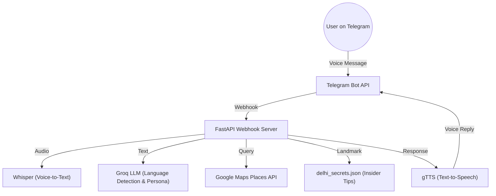

# 🕌 NomadAI: The Ultimate AI Travel Companion for Delhi

> **NomadAI** is not just a bot—it's your witty, multilingual, AI-powered best friend in Delhi! Experience the city like a true local, with real-time recommendations, secret tips, and voice-driven conversations in your language.

---

## 🚀 Features at a Glance

- **🎤 Voice-First Experience:** Send voice messages in any language—get instant, friendly voice replies.
- **🌏 Multilingual & Persona-Driven:** Adapts its personality and language (Hinglish, French, Spanish, English) to match yours.
- **📍 Real-Time Data:** Integrates Google Maps Places API for up-to-date recommendations.
- **🤫 Insider Secrets:** Shares curated, hyperlocal tips from `delhi_secrets.json` you won't find on Google.
- **🧠 AI Pipeline:** Whisper (local `base` model) for speech-to-text, Groq Llama 3 (8B for language & vibe detection, 70B for responses), and gTTS for voice replies.
- **⚡ Deploy Anywhere:** FastAPI backend, Telegram integration, and a Dockerfile ready for Cloud Run or any container host.

---

## 🏗️ Architecture Overview


```mermaid
graph TD;
    User(("User on Telegram"))
    Telegram["Telegram Bot API"]
    FastAPI["FastAPI Webhook Server"]
    Whisper["Whisper (Voice-to-Text)"]
    GroqLLM["Groq LLM (Language Detection & Persona)"]
    GoogleMaps["Google Maps Places API"]
    Secrets["delhi_secrets.json (Insider Tips)"]
    gTTS["gTTS (Text-to-Speech)"]

    User-->|Voice Message|Telegram
    Telegram-->|Webhook|FastAPI
    FastAPI-->|Audio|Whisper
    FastAPI-->|Text|GroqLLM
    FastAPI-->|Query|GoogleMaps
    FastAPI-->|Landmark|Secrets
    FastAPI-->|Response|gTTS
    gTTS-->|Voice Reply|Telegram
```

---

## 🛠️ Quickstart

### 0. **Prerequisites**
- Python 3.10+ (the Docker image uses 3.12)
- **ffmpeg** — required by Whisper for audio decoding (`sudo apt install ffmpeg` or `brew install ffmpeg`)
- A Telegram bot token ([@BotFather](https://t.me/BotFather)), a [Groq API key](https://console.groq.com), and a [Google Maps API key](https://console.cloud.google.com) with Places API enabled

### 1. **Clone the Repo**
```bash
git clone https://github.com/bharat3645/NomadAI.git
cd NomadAI
```

### 2. **Install Dependencies**
```bash
pip install -r requirements.txt
```
If you see permission errors, use `pip install --user -r requirements.txt`.

### 3. **Configure Environment**
Create a `.env` file in the root:
```
TELEGRAM_BOT_TOKEN=your_telegram_bot_token
GROQ_API_KEY=your_groq_api_key
GOOGLE_MAPS_API_KEY=your_google_maps_api_key

# Optional but recommended:
WEBHOOK_URL=https://your-public-url        # if set, the webhook is registered automatically on startup
WEBHOOK_SECRET_TOKEN=any_random_string     # auto-generated on each start if not set
```
The first three keys are required — the app refuses to start without them.

### 4. **Run the Server**
```bash
uvicorn main:app --reload
```

### 5. **Telegram Webhook**
If `WEBHOOK_URL` is set, the bot registers its webhook (with the secret token) automatically on startup — nothing to do.
If not, set it manually via the Bot API. Note that incoming updates are verified against the `X-Telegram-Bot-Api-Secret-Token` header, so a manually set webhook must use the same secret token the server was started with.

### 🐳 **Or Run with Docker**
The image installs ffmpeg and all dependencies for you:
```bash
docker build -t nomadai .
docker run --env-file .env -p 8080:8080 nomadai
```
The container listens on `$PORT` (default `8080`), which makes it Cloud Run–compatible out of the box.

---

## 🤖 How It Works

1. **User sends a voice message** to the Telegram bot.
2. **Whisper** (local `base` model) transcribes the audio to text.
3. **Groq Llama 3 8B** detects the language *and* the user's vibe (adventurous, hungry, relaxed, ...) in a single JSON call.
4. **Google Maps Places API** fetches the top live recommendations for the query in Delhi.
5. **Insider tips** are matched from `delhi_secrets.json` when a known landmark appears in the query.
6. **Groq Llama 3 70B** synthesizes a persona-driven response, aware of the current Delhi time, the user's vibe, and the last two exchanges of conversation history.
7. **gTTS** converts the reply to speech.
8. **The bot sends a voice reply** back to the user.

**Bot commands:** `/start` (welcome + resets conversation history) · `/feedback <text>` (logs your feedback)
**Endpoints:** `POST /` (Telegram webhook, secret-token protected) · `GET /health` (health check)

---

## 🗺️ Example Insider Tips Database (`delhi_secrets.json`)
```json
{
  "Hauz Khas Village": {
    "vibe": "artsy, bohemian, a bit pricey",
    "universal_tip": "Insider tip: Avoid the main lake-view cafes. Find the small, unnamed tea stall near the entrance. The tea is better and cheaper, and you'll meet actual artists, not just influencers."
  },
  "Chandni Chowk": {
    "vibe": "chaotic, historical, foodie paradise",
    "universal_tip": "Real secret: Go to 'Paranthe Wali Gali' but your main goal is to find 'Kuremal Mohan Lal Kulfi' deep inside the market. It's a life-changing fruit-stuffed kulfi.",
    "warning": "Be careful with your phone and wallet, it gets very crowded."
  }
}
```

---

## 🌟 Why NomadAI Stands Out
- **Persona Chameleon:** Adapts tone, slang, and warmth to your language and vibe.
- **Voice-to-Voice Magic:** Full duplex—speak and get spoken to, no typing needed.
- **Local Wisdom:** Goes beyond Google with real, lived-in tips.
- **Context-Aware:** Knows the current time in Delhi and remembers the last couple of exchanges, so follow-ups like "how do I get there?" just work.
- **Extensible:** Add more cities, languages, or data sources with ease.

---

## 🧩 Extending NomadAI
- Add more landmarks and tips in `delhi_secrets.json`.
- Expand the persona map in `main.py` for new languages or cities.
- Integrate more APIs (weather, events, etc.).
- Deploy the container to Cloud Run, Render, or any Docker host.

---

## 📝 File Structure
- `main.py` — Core logic (FastAPI webhook, Telegram handlers, AI pipeline, APIs)
- `delhi_secrets.json` — Local tips database
- `requirements.txt` — Python dependencies
- `Dockerfile` — Container image (installs ffmpeg + deps)
- `entrypoint.sh` — Container entrypoint; serves on `$PORT` (default 8080)
- `LICENSE` — MIT license
- `README.md` — This file

---

## 🛡️ License
This project is licensed under the MIT License — see [LICENSE](./LICENSE) for the full text.

---

## 💡 Inspiration & Credits
- Built for hackathons, travel lovers, and Delhi explorers.
- Powered by OpenAI Whisper, Groq (Llama 3), Google Maps, gTTS, and the amazing Python community.

---

## 🙌 Contributing
Pull requests and ideas welcome! Let's make travel smarter, together.
